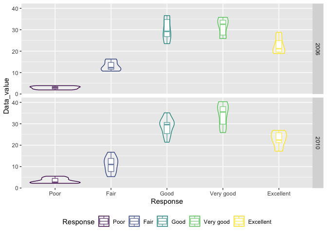

p8105\_hw3\_cw3370
================

# Problem 1

<font size = 5>The goal is to do some exploration of this dataset. To
that end, write a short description of the dataset, noting the size and
structure of the data, describing some key variables, and giving
illstrative examples of observations. Then, do or answer the
following</font>

``` r
data("instacart")
force(instacart)
```

<font size = 4 face="Times New Roman"> Instacart includes 1384617
observations for 15 variables. For variables, they are order\_id,
product\_id, add\_to\_cart\_order, reordered, user\_id, eval\_set,
order\_number, order\_dow, order\_hour\_of\_day,
days\_since\_prior\_order, product\_name, aisle\_id, department\_id,
aisle, department.

order\_id is the order id.

product\_id, product\_name is the id and name of product, which are the
key variable.

add\_to\_cart\_order is order in which each product was added to cart.

reordered shows whether the user bought this product before.

user\_id is the user id.

order\_number, order\_hour\_of\_dayis the order sequence number for
user, the day of week and the hour of day order was placed.

days\_since\_prior\_order is days since the last order.

aisle\_id, aisle is the id and name of aisle, which are the key
variable.

department\_id, department is the id and name of department.

For example, the first observation shows a customer whose user id is
112108, buy Bulgarian Yogurt(product id:49302) for the 1 time at 10
o’clock in the 4 day of week,which is the 1 product in this order. This
product belongs to yogurt aisle(aisle id:120) and dairy eggs
department(department id:16). </font>

<font size = 5>How many aisles are there, and which aisles are the most
items ordered from?</font>

``` r
nrow(distinct(instacart,aisle))
```

    ## [1] 134

``` r
most_items_aisle <- instacart %>% 
  group_by(aisle) %>% 
  summarize(n_items = n()) %>% 
  arrange(desc(n_items))
```

<font size = 4 face="Times New Roman"> There are 134 aisles and fresh
vegetables is the most items ordered from.

<font size = 5>Make a plot that shows the number of items ordered in
each aisle, limiting this to aisles with more than 10000 items ordered.
Arrange aisles sensibly, and organize your plot so others can read
it.</font>

``` r
number_items_aisle <- instacart %>%
  count(aisle) %>% 
  filter(n > 10000) %>% 
  mutate(
    rank = rank(desc(n))
  )

## blue number means the rank, black number means the number of items. the aisle are ordered by first letter.
ggplot(data = number_items_aisle,aes(x = aisle, y = n)) +
  geom_bar(alpha = 0.4, stat = "identity") +
  geom_text(aes(label = n,hjust = 0.8),alpha = 0.5) + 
  geom_text(aes(label = rank,hjust = -1.5),color ="blue",alpha = 0.5) +
  labs(title = "Number of Items For Aisles", x = "Aisle",y = "Number of Items" ) +
  coord_flip()
```

<!-- -->
<font size = 4 face="Times New Roman">blue number means the rank, black
number means the number of items. the aisle are ordered by first
letter.</font>

<font size = 5>Make a table showing the three most popular items in each
of the aisles “baking ingredients”, “dog food care”, and “packaged
vegetables fruits”. Include the number of times each item is ordered in
your table.</font>

``` r
most_popular_items <- instacart %>% 
  filter(aisle ==  "baking ingredients" | aisle == "dog food care"|aisle == "packaged vegetables fruits") %>% 
  group_by(aisle,product_name) %>% 
  summarize(Number = n()) %>% 
  mutate(popular_rank = order(order(Number, decreasing = TRUE))) %>% 
  filter(popular_rank %in% c(1:3)) %>% 
  arrange(aisle,desc(Number)) 
```

    ## `summarise()` has grouped output by 'aisle'. You can override using the `.groups` argument.

``` r
knitr::kable(most_popular_items)
```

| aisle                      | product\_name                                 | Number | popular\_rank |
|:---------------------------|:----------------------------------------------|-------:|--------------:|
| baking ingredients         | Light Brown Sugar                             |    499 |             1 |
| baking ingredients         | Pure Baking Soda                              |    387 |             2 |
| baking ingredients         | Cane Sugar                                    |    336 |             3 |
| dog food care              | Snack Sticks Chicken & Rice Recipe Dog Treats |     30 |             1 |
| dog food care              | Organix Chicken & Brown Rice Recipe           |     28 |             2 |
| dog food care              | Small Dog Biscuits                            |     26 |             3 |
| packaged vegetables fruits | Organic Baby Spinach                          |   9784 |             1 |
| packaged vegetables fruits | Organic Raspberries                           |   5546 |             2 |
| packaged vegetables fruits | Organic Blueberries                           |   4966 |             3 |

<font size = 5>Make a table showing the mean hour of the day at which
Pink Lady Apples and Coffee Ice Cream are ordered on each day of the
week; format this table for human readers (i.e. produce a 2 x 7
table)</font>

``` r
## l adjust the order time into hour,minute,second
mean_hour_of_order <- instacart %>% 
  filter(product_name == "Pink Lady Apples"|product_name == "Coffee Ice Cream") %>% 
  select(order_dow,order_hour_of_day,product_name) %>% 
  group_by(product_name,order_dow) %>% 
  summarize(mean_hour = mean(order_hour_of_day)) %>% 
  mutate(order_dow = recode(order_dow , 
                            '0' = "Sunday",'1' = "Monday",'2' = "Tuesday",
                            '3' = "Wednesday",'4' = "Thursday",'5' = "Friday",'6' = "Saturday"),
         hour = mean_hour %/% 1,
         minute = (mean_hour %% 1*60) %/% 1,
         second = round(round((mean_hour %% 1*60) %% 1,5)*60),
         time = hms(paste(hour,minute,second,sep = ":"))
         ) %>%
  select(product_name,order_dow,time) %>% 
  pivot_wider(
    names_from = "order_dow",
    values_from = "time"
  )
```

    ## `summarise()` has grouped output by 'product_name'. You can override using the `.groups` argument.

``` r
knitr::kable(mean_hour_of_order)
```

| product\_name    |      Sunday |      Monday |     Tuesday |  Wednesday |   Thursday |      Friday |    Saturday |
|:-----------------|------------:|------------:|------------:|-----------:|-----------:|------------:|------------:|
| Coffee Ice Cream | 13H 46M 27S | 14H 18M 57S | 15H 22M 51S | 15H 19M 5S | 15H 13M 3S | 12H 15M 47S |  13H 50M 0S |
| Pink Lady Apples | 13H 26M 28S | 11H 21M 36S |  11H 42M 8S | 14H 15M 0S | 11H 33M 6S |  12H 47M 4S | 11H 56M 15S |

# Problem 2

<font size = 5>Do some data cleaning.</font>

``` r
data("brfss_smart2010")
force(brfss_smart2010)

brfss_smart2010 <- brfss_smart2010 %>% 
  filter(Topic == "Overall Health" & Response %in% c("Excellent","Very good","Good","Fair","Poor")) %>% 
  mutate(
    Response = factor(Response,ordered = TRUE,levels = c("Poor","Fair","Good","Very good","Excellent"))
  )
```

<font size = 5>In 2002, which states were observed at 7 or more
locations? What about in 2010?</font>

``` r
locations_observed_2002 <- 
  brfss_smart2010 %>% 
  separate(Locationdesc,into = c("state","Location"),sep = 5) %>% 
  select(-state,State = Locationabbr) %>%
  filter(Year == 2002) %>% 
  group_by(State)%>%
  summarize(location_number = n()/5) %>% 
  filter(location_number >=7)
knitr::kable(locations_observed_2002)
```

| State | location\_number |
|:------|-----------------:|
| CT    |                7 |
| FL    |                7 |
| MA    |                8 |
| NC    |                7 |
| NJ    |                8 |
| PA    |               10 |

<font size = 4 face="Times New Roman">States observed at 7 or more
locations in 2002 are shown above</font>

``` r
locations_observed_2010 <- 
  brfss_smart2010 %>% 
  separate(Locationdesc,into = c("state","Location"),sep = 5) %>% 
  select(-state,State = Locationabbr) %>%
  filter(Year == 2010) %>% 
  group_by(State) %>%
  summarize(location_number = n()/5) %>% 
  filter(location_number >= 7)


knitr::kable(locations_observed_2010)
```

| State | location\_number |
|:------|-----------------:|
| CA    |               12 |
| CO    |                7 |
| FL    |               41 |
| MA    |                9 |
| MD    |               12 |
| NC    |               12 |
| NE    |               10 |
| NJ    |               19 |
| NY    |                9 |
| OH    |                8 |
| PA    |                7 |
| SC    |                7 |
| TX    |               16 |
| WA    |               10 |

<font size = 4 face="Times New Roman">States observed at 7 or more
locations in 2010 are shown above </font>

<font size = 5>Construct a dataset that is limited to Excellent
responses, and contains, year, state, and a variable that averages the
data\_value across locations within a state. Make a “spaghetti” plot of
this average value over time within a state (that is, make a plot
showing a line for each state across years – the geom\_line geometry and
group aesthetic will help).</font>

``` r
average_excellent <- 
  brfss_smart2010 %>% 
  filter(Response == "Excellent") %>% 
  select(Year, State = Locationabbr, Data_value) %>% 
  group_by(Year,State) %>%
  summarize(
    mean_value = mean(Data_value,na.rm = TRUE)
    ) 
```

    ## `summarise()` has grouped output by 'Year'. You can override using the `.groups` argument.

``` r
ggplot(average_excellent,aes(x = Year, y = mean_value,group = State, color = State))+
  geom_point(alpha = 0.3) +
  geom_line(alpha = 0.7) +
  theme(legend.position = "bottom")
```

<!-- -->
<font size = 4 face="Times New Roman">It is hard to say that the average
value of excellent response within each state have a pattern. From the
beginning and the end, l can conclude that average value of excellent
response have decreased over time.</font>

<font size = 5>Make a two-panel plot showing, for the years 2006, and
2010, distribution of data\_value for responses (“Poor” to “Excellent”)
among locations in NY State.</font>

``` r
distribution_response <- 
  brfss_smart2010 %>% 
  select(Year, Response,State = Locationabbr, Data_value) %>% 
  filter(State == "NY",
         Year %in% c(2006,2010)) 

ggplot(distribution_response,aes(x = Response, y = Data_value))+
  geom_boxplot(aes(color = Response)) +
  theme(legend.position = "bottom")
```

<!-- -->

``` r
  facet_grid(1.~Year)
```

    ## <ggproto object: Class FacetGrid, Facet, gg>
    ##     compute_layout: function
    ##     draw_back: function
    ##     draw_front: function
    ##     draw_labels: function
    ##     draw_panels: function
    ##     finish_data: function
    ##     init_scales: function
    ##     map_data: function
    ##     params: list
    ##     setup_data: function
    ##     setup_params: function
    ##     shrink: TRUE
    ##     train_scales: function
    ##     vars: function
    ##     super:  <ggproto object: Class FacetGrid, Facet, gg>

<font size = 4 face="Times New Roman">The data value of “Excellent” and
“Poor” didn’t change a lot over time. The data value of “Fair” and
“Good”,decrease a little. The data value of “Very Good” increase a
lot.It seems that many people who chose “Fair” and “Good” in 2006 choose
“Very Good” in 2010.</font>

# Problem 3

``` r
accelerometers_df <- read_csv("data/accel_data.csv")
```

    ## Rows: 35 Columns: 1443

    ## ─ Column specification ────────────────────────────
    ## Delimiter: ","
    ## chr    (1): day
    ## dbl (1442): week, day_id, activity.1, activity.2, activity.3, activity.4, ac...

    ## 
    ## ℹ Use `spec()` to retrieve the full column specification for this data.
    ## ℹ Specify the column types or set `show_col_types = FALSE` to quiet this message.

<font size = 5>Load, tidy, and otherwise wrangle the data. Your final
dataset should include all originally observed variables and values;
have useful variable names; include a weekday vs weekend variable; and
encode data with reasonable variable classes. Describe the resulting
dataset (e.g. what variables exist, how many observations, etc).</font>

``` r
accelerometers_df_hm <- accelerometers_df %>% 
  mutate(day_type = case_when(
    day %in% c("Monday","Tuesday","Wednesday","Thursday","Friday") ~ "weekday",
    day %in% c("Saturday","Sunday") ~ "weekend"
  )) %>% 
  pivot_longer(
    activity.1:activity.1440,
    names_to = "Minute",
    names_prefix = "activity.",
    values_to = "activity"
  ) %>% 
  mutate(activity = round(activity,2),
         Minute = as.numeric(Minute)-1,
         hour = Minute %/% 60,
         minute = Minute %% 60,
         day_of_week = recode(day,"Sunday" = "7","Monday"= "1","Tuesday"= "2","Wednesday"= "3", "Thursday"= "4","Friday"= "5","Saturday"= "6")) %>% 
  arrange(week,day_of_week) %>% 
  select(week,day_id,day,day_of_week,day_type,Minute,hour,minute,activity,)
```

<font size = 4 face="Times New Roman"> accelerometers\_df\_hm includes
50400 observations for 9 variables. For variables, they are week,
day\_id, day, day\_of\_week, day\_type, Minute, hour, minute, activity.

week is week.

day\_id is day identifier.

day is day of week, such as Monday, Tuesday.

day\_of\_week is day sequence of week. I set the first day of week is
monday, which is 1.

day\_type is day type, weekday or weekend

Minute is Minute of the day.

hour is the hour of the day

minute is the minute of the hour

activity is the activity. </font>

<font size = 5>Traditional analyses of accelerometer data focus on the
total activity over the day. Using your tidied dataset, aggregate
accross minutes to create a total activity variable for each day, and
create a table showing these totals. Are any trends apparent?</font>

``` r
day_total_activity <- accelerometers_df_hm %>% 
  group_by(week,day_of_week) %>% 
  summarize(
    total_activity = sum(activity)
  ) %>% 
  mutate(day_of_week_eng = recode(day_of_week, 
                            '7' = "Sunday",'1' = "Monday",'2' = "Tuesday",
                            '3' = "Wednesday",'4' = "Thursday",'5' = "Friday",'6' = "Saturday"))
```

    ## `summarise()` has grouped output by 'week'. You can override using the `.groups` argument.

``` r
knitr::kable(day_total_activity)
```

| week | day\_of\_week | total\_activity | day\_of\_week\_eng |
|-----:|:--------------|----------------:|:-------------------|
|    1 | 1             |        78828.18 | Monday             |
|    1 | 2             |       307094.19 | Tuesday            |
|    1 | 3             |       340115.01 | Wednesday          |
|    1 | 4             |       355923.72 | Thursday           |
|    1 | 5             |       480542.61 | Friday             |
|    1 | 6             |       376254.00 | Saturday           |
|    1 | 7             |       631105.00 | Sunday             |
|    2 | 1             |       295431.00 | Monday             |
|    2 | 2             |       423245.00 | Tuesday            |
|    2 | 3             |       440962.00 | Wednesday          |
|    2 | 4             |       474048.00 | Thursday           |
|    2 | 5             |       568839.00 | Friday             |
|    2 | 6             |       607175.00 | Saturday           |
|    2 | 7             |       422018.00 | Sunday             |
|    3 | 1             |       685910.00 | Monday             |
|    3 | 2             |       381507.00 | Tuesday            |
|    3 | 3             |       468869.00 | Wednesday          |
|    3 | 4             |       371230.00 | Thursday           |
|    3 | 5             |       467420.00 | Friday             |
|    3 | 6             |       382928.00 | Saturday           |
|    3 | 7             |       467052.00 | Sunday             |
|    4 | 1             |       409450.00 | Monday             |
|    4 | 2             |       319568.00 | Tuesday            |
|    4 | 3             |       434460.00 | Wednesday          |
|    4 | 4             |       340291.00 | Thursday           |
|    4 | 5             |       154049.00 | Friday             |
|    4 | 6             |         1440.00 | Saturday           |
|    4 | 7             |       260617.00 | Sunday             |
|    5 | 1             |       389080.00 | Monday             |
|    5 | 2             |       367824.00 | Tuesday            |
|    5 | 3             |       445366.00 | Wednesday          |
|    5 | 4             |       549658.00 | Thursday           |
|    5 | 5             |       620860.00 | Friday             |
|    5 | 6             |         1440.00 | Saturday           |
|    5 | 7             |       138421.00 | Sunday             |

``` r
ggplot(day_total_activity,aes(x = day_of_week, y = total_activity,group = week))+
  geom_point(alpha = 0.4)+
  geom_line(aes(color = week))+
  scale_x_discrete(breaks = c(1,2,3,4,5,6,7),
                   labels = c("Monday","Tuesday","Wednesday","Thursday","Friday","Saturday","Sunday"))+
  viridis::scale_color_viridis(
    name = "week", 
    discrete = FALSE
  )
```

<!-- -->
<font size = 4 face="Times New Roman">By checking the data, l can find
the total activity of Saturday in week 4 and week 5 is 1440, which means
the activity of each minute in this day is 1.00, which is relatively
impossible, so l try to analyze the trend without this two outliers.

From the plot, l find that the activity from Tuesday to Friday is stable
and is usually increasing(except Friday in week 4).The activity of
Saturday are close to the activity of weekday, the activity of Sunday
are fluctuant, which is relatively low in week 4 and week 5. The
activity of Monday are close to the activity of other weekdays, the
exception is Moday in week 1 which may due to the start of the
experiment.</font>

<font size = 5>Accelerometer data allows the inspection activity over
the course of the day. Make a single-panel plot that shows the 24-hour
activity time courses for each day and use color to indicate day of the
week. Describe in words any patterns or conclusions you can make based
on this graph.</font>

``` r
daily_activity <- accelerometers_df_hm %>% 
  group_by(week,day_of_week,hour) %>% 
  summarize(
    hour_activity = sum(activity)
  ) 
```

    ## `summarise()` has grouped output by 'week', 'day_of_week'. You can override using the `.groups` argument.

``` r
accelerometers_df_hm %>% 
  filter(activity != 1.00) %>% 
  ggplot(aes(x = Minute , y = activity,group = day)) +
  geom_line(aes(color = day),alpha = 0.5) +
  geom_point(aes(color = day),alpha = 0.5,size = 0.5) +
  geom_rug(aes(color = day),alpha = 0.5)+
  scale_x_continuous(breaks = c(0,120,240,360,480,600,720,840,960,1080,1200,1320,1440),
                     labels = c("0:00","2:00","4:00","6:00","8:00","10:00","12:00","14:00","16:00","18:00","20:00","22:00","24:00"))
```

<!-- -->
<font size = 4 face="Times New Roman">From the plot, l find that the
activity of this man from 6:00 to 22:00 is much higher than the activity
from 22:00 to 6:00 tomorrow, which might be the sleep time of this man.

During the 6:00 to 22:00, there are several time period that the
activity of this man are extermely high: 7:00-7:30 in Thursday,
11:00-12:00 in Sunday, 16:30-17:00 in Monday and Sunday,19:30-20:00 in
Wednesday, 20:00-22:00 in Friday. By comparing the number of point, l
guess that this man has some regular activity in 11:00-12:00,16:30-17:00
in Sunday and 20:00-22:00 in Friday </font>
